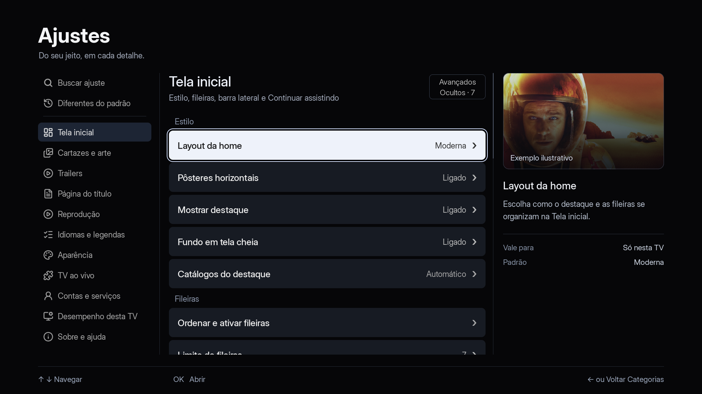

# Integração local para 1.7.2 — 02/10/2026

Base: `origin/master` em `2bc9659b` (1.7.1). Worktree: `/private/tmp/nv-172`, branch `release/1.7.2`.

`agente/abrirrapido` integrada em `971788b2`; já contém `agente/ilhavolta` e `agente/i221`. `agente/i216` integrada em `4fa3647e`. Sem conflitos e sem push, tag, release ou comentário em issue.

## Verificação focada

Passaram: `i18n.sh`, `fonteauto.sh`, `fontecache_vod.sh`, `fontevolta.sh`, `ilha_voo.sh`, `ponteiro_toque.sh`, `sessao_email.sh`, `fontes_parcial.sh`, `player_retido.sh`. Logs locais em `/private/tmp/nv172-<teste>.log`. São testes de host, não confirmação nas TVs.

A TCL recebeu o APK estável 1.7.1 de `~/.cache/nuvio-rel-171`, com SHA256 conferido, instalação `-r` bem-sucedida e abertura confirmada por processo ativo. Android confirmou `versionCode=10701`, `versionName=1.7.1`. Essa instalação foi anterior à 1.7.2; houve relato posterior de APK social por outra sessão e o pacote atual da TCL não foi reconsultado. O recorte de logcat da abertura não contém marcadores de crash; não comprova reprodução ou interação.

## Pendências de decisão e teste

- Dono decidiu retenção de dois minutos. Durante retenção o pipeline único impede trailer da Home; após o prazo, a fonte guardada continua disponível para retomada.
- Manifestos identificados como1.7.2 nos pacotes locais. Escopo continua aberto; nenhum tag ou publicação autorizado.
- O dono testa o comportamento nas TVs; não rodar suíte longa nem controlar aparelhos sem combinar e obter a trava exclusiva.
- Pré-busca MKV: corrigido apenas o valor impresso. A espera original foi conservada.
- Android já prepara com posição local válida e fallback, testado em fixtures/JNI/Kotlin. Ganho real no aparelho ainda não medido. Conferência paralela da abertura normal foi adiada pelo efeito de sondas em debrid.
- Catálogo e histórico corrigidos: travas nos acessos, identidade em atualizações, geração por conta/perfil/credencial. Focados com ASan/UBSan e concorrência com ThreadSanitizer passaram.
- Plugins/P2P ficam para 1.8. Ajustes funcionais integrados por escolha do dono; peles A/B, ícones de apoiador e social continuam fora.
- Respostas nas issues exigem autorização do dono.

## Ajustes funcionais

Merge `f9083b10`; regressão #221 em `61ab2263`. 184 opções, 11 categorias. Passaram dados, interação, seções, padrões, perfis e i18n (zero falhas). Confirmação, cancelamento, Voltar, restaurar, busca e avançados exercitados com teclas simuladas; não são controle físico. Espera pelos addons conserva cinco segundos, quatro escolhas, alcance local, entrada única e busca.

12 capturas nativas em `/private/tmp/nv172-ajustes-ux-review`. Amostras desta integração:

[Seletor](ajustes-seletor.png) · [Trailers](ajustes-trailers.png)

Arte do painel é ilustrativa, não reprodução de mídia. Revisão local confirmou foco distinto, texto escuro no foco claro e informação auxiliar legível. Cadência e memória na GPU da TV continuam pendentes.

## Consistência e retorno ao filme

Syncordem, contaoffline e contaoffline_limites ASan/UBSan: PASS. Push500 não apaga edição local; ack antigo não perde nova edição; retentativa60s sem rajada; não aplica pull anterior ao push. Perfil/conta do snapshot isolados. Sem diagnóstico demonstrado nem deploy para o HTTP500 remoto.

Android: regra numérica/JNI com ASan/UBSan, integração de player normal e Kotlin/NDK PASS. Fixture aceitou612.345s na preparação com zero seek; ponte recusada gerou um seek; só percentual não inventa duração; sessão retida não recarrega; live não busca; episódios/perfis separados. Marco de log distingue ponto aceito na preparação. Zero medições de velocidade física nesta rodada.

Ícone TPK: mesmo PNG embutido, carga preguiçosa,600quadros com um upload por contexto, cleanup/reinit/falhaGL PASS. SintaxeTPK e i18n PASS. ASan dessa fixtureGL travou antes de main; resultado indisponível, não aprovação. Não mudou o host .NET.

## Casos do dono nas TVs

1. LG C9: minimizar/voltar antes de120s sem novo load; depois120s liberar pipeline/retomar fonte; Xtream por tempo suficiente para reproduzir a pausa relatada em#158; legenda ASS embutida de MKV.
2. TCL: retomada no ponto salvo (comparar marcos URL→primeiroquadro e ack), fonte vencida com fallback, live sem seek, toque/login, troca de app/HDR.
3. Samsung: fontes incrementais#221 e espera configurada, Ajustes/busca/Voltar no controle, ícone em pacote completo e autoatualização, proporção da mesma fonte#195. Distinguir modos de recorte indisponíveis do backend.
4. Todas: trocar perfil e logout enquanto histórico/fontes chegam; selo de assistido correto; Continuar assistindo#144 sem cintilação; catálogo/localização no cenário do relator#195/#197/#209.

Nenhum desses casos foi confirmado nos aparelhos nesta rodada. A última instalação feita por esta rodada na TCL foi o APK estável 1.7.1; o roadmap registra relato posterior de APK social instalado por outra sessão. O pacote atual no aparelho não foi reconsultado e nenhuma 1.7.2 desta rodada foi instalada.

## Sonda de fonte

`5fcae85c`: testa HTTP500,403comReferer,206,redirecionamento,corpoparcial,URL>2000/truncamento,timeout e servidor ignorandoRange. Normal e ASan/UBSan PASS; corpo nativo descartado com limite, sem baixar mídia inteira para sondar. Fim da URL ainda não é reutilizado para reprodução; não afirmar que remove o segundo redirecionamento. PolíticaWGT/EMJS PASS, sem cópia do corpo ao heapWASM. XHR síncrono mantém limitações de cancelamento/timeout e pode receber corpo do servidor se este ignorarRange. AVPlay ainda decide401/403 quando o addon exige cabeçalho proibido pelo navegador. Fonteauto/cache/volta e sintaxeTPK4/6 PASS.

## Fila durável e pacote final local

`d8402e54`: syncordem e contaoffline com ASan/UBSan passaram. O teste usa processos separados para HTTP500 → encerrar → reabrir, restauração antes da rede e ACK exato. Cobre nome vazio, addon desligado, contas A→B→A, perfis, edição durante POST, ACK de perfil anterior, falhas de escrita/leitura/remoção, leitura transitória no boot, logout de todas as identidades e oito entradas em RAM. Snapshots gravados podem sair da RAM e voltar do disco; snapshot cuja gravação falhou permanece em RAM. Não há acesso à fila no disco por quadro. Revisão independente reproduziu e confirmou a correção das bordas de leitura no boot e no ACK. Log: `/Volumes/ExternalSSD/nv172-syncordem-fila.log`.

`fc711f6b`: exclusões/guards dos pacotes cobrem `conta-*.txt` e temporários; templates explícitos fazem mktemp respeitar TMPDIR. Sintaxe shell, conferência dos guards e regressão de caminho SSD passaram. Foi o commit comum do lote conferido, depois reclassificado como intermediário pelo achado de identidade da ilha. Resultados de cada pacote e checksums ficam em [PACOTES.md](PACOTES.md); validação física ainda pendente.

## Isolamento da atividade da ilha

`b71471bc20e36806de9665145e4898c5e8e67884`: defeito confirmado por callchain e corrigido no cartão VOD e em suas cópias. Validação por conta/perfil antes de eventos/atualização, inclusive login e escolha de perfil; guard por instância antes do fallback. Troca de identidade limpa cartão, pílula, modal, pedido, arte e voo. Owner ainda rastreável após cartão ocioso; mesma sessão durante indisponibilidade conserva a retomada. Avisos, estreia e prazos existentes ficam preservados.

Fixture puro usando o estado real de ilhacart/ilha, com catálogo/identidade/timer dublados: `TMPDIR=/Volumes/ExternalSSD/nv172-build-tmp SANITIZE=1 bash tests/ilhacart_identidade.sh` retornou zero e `tudo ok`. Cobre troca de perfil/conta, logout/relogin, mesmo IMDb/episódio, instância antiga, modal/pedido/voo, 30 minutos e preservação de aviso/estreia. Sintaxe app/ilha/ilhacart e diffcheck PASS; revisão independente sem blocker. Log: `/Volumes/ExternalSSD/nv172-ilhacart-identidade.log`. Não é reprodução/validação em TV. O novo lote comum usa esse hash: conferências Android/LG/Samsung PASS, 13 anexos locais e 12 checksums aprovados. Nenhuma instalação/publicação. Relatórios em PACOTES.md; o mockup é proposta independente em ILHA-PROPOSTA.md.
